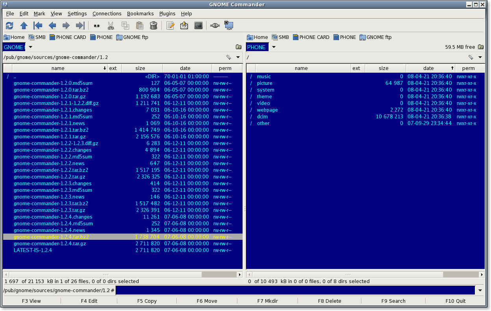

# Gnome Commander #

## Introduction ##

Gnome Commander is a fast and powerful twin-panel file manager for the Linux desktop.

Gnome Commander is released under the GNU General Public License (GPL) version 3,
see the file [COPYING](COPYING) for more information.

Check the list of [releases](https://gitlab.gnome.org/GNOME/gnome-commander/-/releases) to see what has changed in each version.

### Scripts for the file popup menu

In the [gcmd-scripts directory](gcmd-scripts) some sample scripts can be found.
Move them into `~/.gnome-commander/scripts/` to extend the file popup menu.

## Contributing ##

You want to help? That’s great! See [CONTRIBUTING file](CONTRIBUTING.md) for information.
